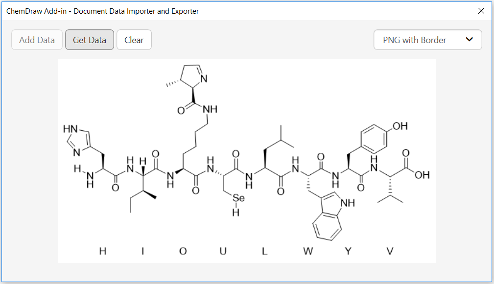
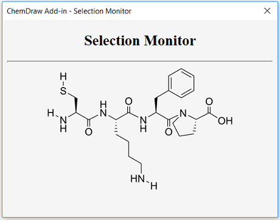
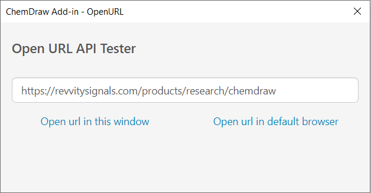

# ChemDraw Add-in Examples

Welcome to the ChemDraw add-in examples! This directory contains all the examples used in the [ChemDraw Add-in Developer Guide](https://github.com/PerkinElmer/ChemDraw-AddIns/tree/master/Documentation).

## Hello World

A simple ChemDraw add-in that shows the version of the ChemDraw JavaScript API.

## Document Data Importer and Exporter

A ChemDraw add-in that uses ChemDraw JavaScript API to add and get data in the active document. The supported data formats are CDXML, CDX encoded as [Base64](https://en.wikipedia.org/wiki/Base64), [SMILES](http://www.daylight.com/dayhtml/doc/theory/theory.smiles.html), [InChI](https://iupac.org/who-we-are/divisions/division-details/inchi/), [InChIKey](https://iupac.org/who-we-are/divisions/division-details/inchi/), [MolV2000](http://accelrys.com/products/collaborative-science/biovia-draw/ctfile-no-fee.html), [MolV3000](http://accelrys.com/products/collaborative-science/biovia-draw/ctfile-no-fee.html), [RXNV2000](http://accelrys.com/products/collaborative-science/biovia-draw/ctfile-no-fee.html), [RXNV3000](http://accelrys.com/products/collaborative-science/biovia-draw/ctfile-no-fee.html), and PNG encoded as [Base64](https://en.wikipedia.org/wiki/Base64).

## Selection Monitor

A ChemDraw add-in that uses the selection API to get the preview image of the selected structures in the active document.

## Open URL

A ChemDraw add-in that uses the openURLInDefaultBrowser API to open a given URL in system's default browser.

